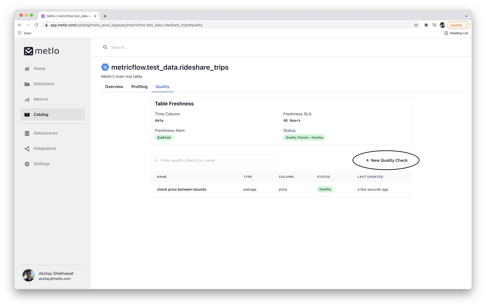

# Creating Data Quality Checks

Data Quality checks are created per table. You can view the quality checks on the specific table page by clicking on `Quality` tab, right below the heading:

A new quality check can be created by clicking on the `+ New Quality Check`  button, located right below the `Table Freshness` card.&#x20;

## Info

The first step is to enter some basic metadata for your data quality check:

* **Name -** The name of the data quality check
* **Check Type -** The kind of check that is to be defined on the table.
* **Time Granularity -** The granularity of time groupings. Queries can thus be grouped by&#x20;
  * Hour - Group by hour of data
  * Day - Group by day of data
  * Week - Group by **week** of data
  * Month - Group by month of data
  * Unset - No groupings to be used.
* **Enabled -** Should this data quality check run or not
* **Muted -** Should this data quality check send a message on condition failure or not

## Params

Depending on the kind of check defined in the `Info` section, some parameters need to be populated. These parameters can vary depending on the the `Check Type` defined.

## Schedule

The next step is to setup the schedule for data quality checks. The time is in UTC.

* Time of Day - Time when the check should run
* Window Size - The period for which the data is to be analyzed
* Offset - Offset from `Time of Day` when query should run. This allows us to construct data windows with start and end times of&#x20;
  * Start time : (Current time) - (Offset)
  * End time : (Current time) - (Offset) - (Window Size)
* Frequency : How frequently the check should be run
  * Weekly - Once  a week
  * Daily - Once a day
  * Hourly - Once an hour

## Notifications

By default, when some data quality checks are not satisfied, a message is sent out via slack to the default channel set for an organization.&#x20;
